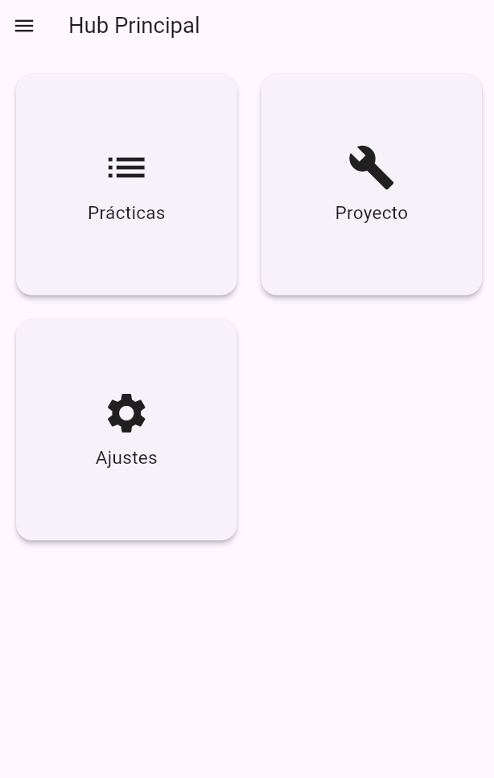
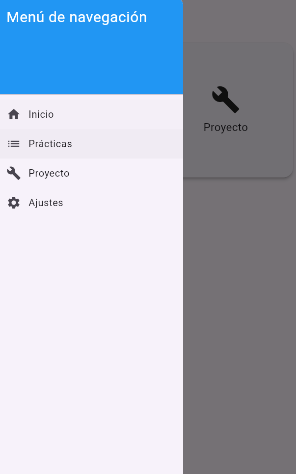
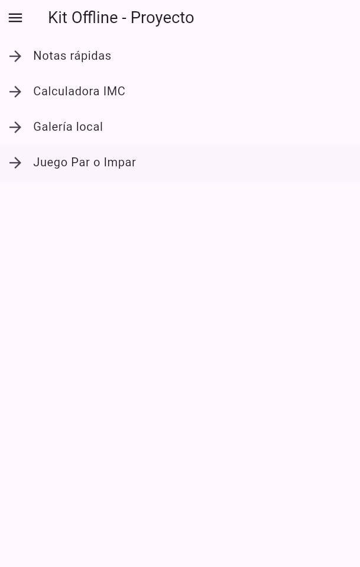
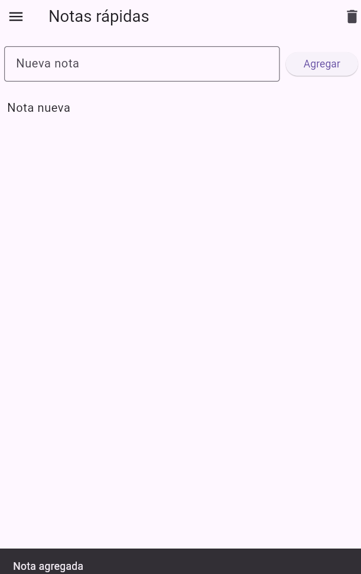
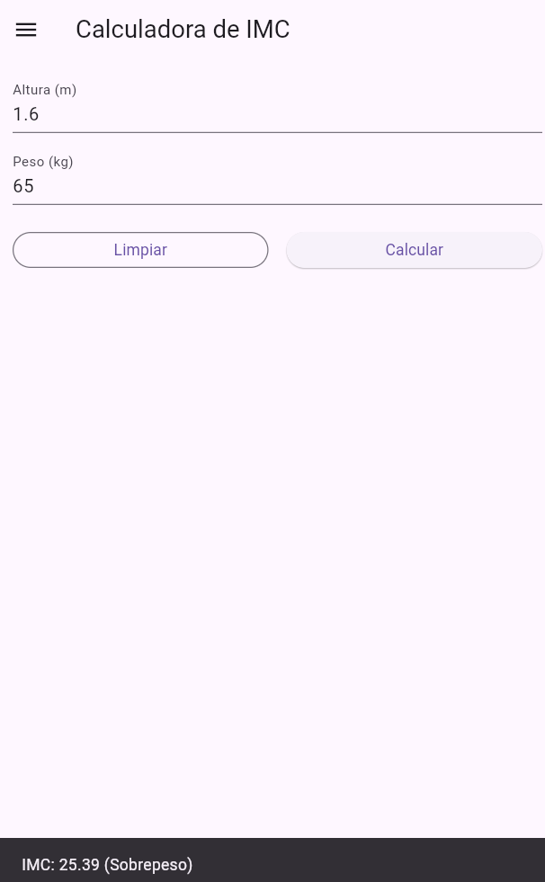
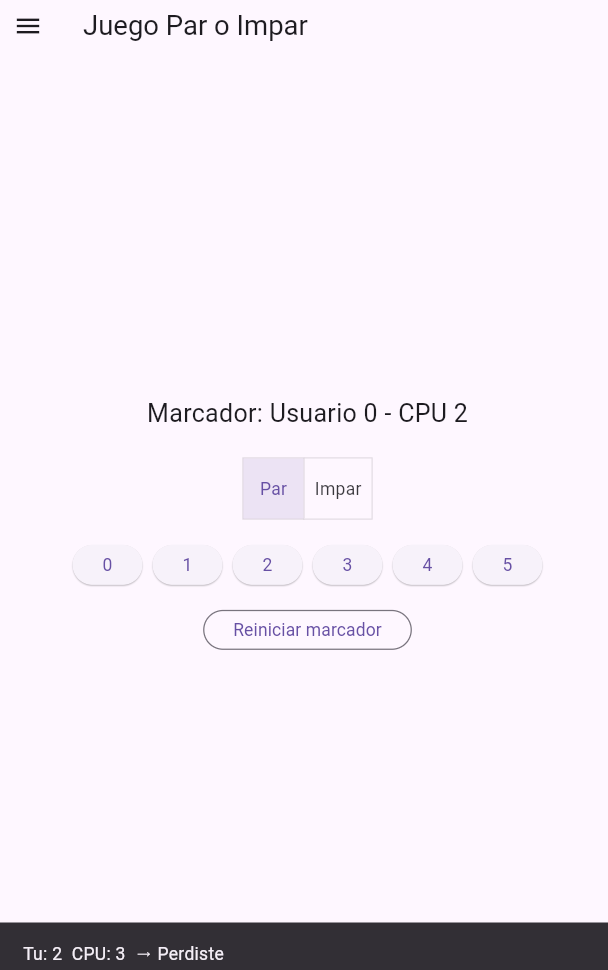
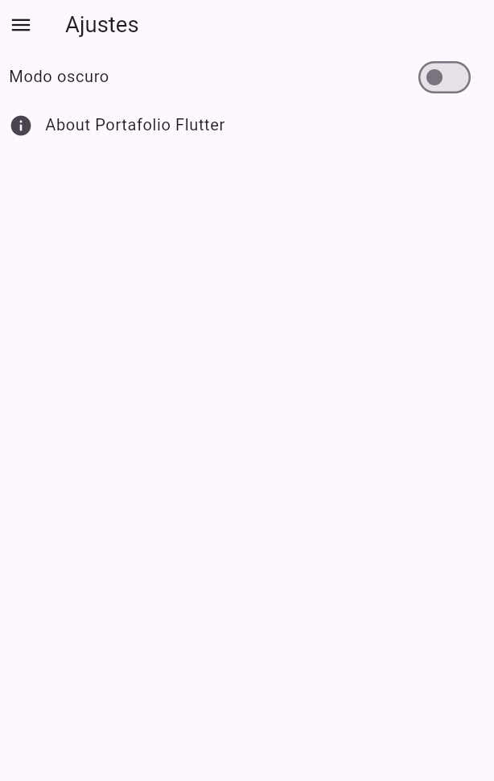

# AppHub Portafolio + Kit Offline

Proyecto **1er Departamental** de la materia **Desarrollo de Aplicaciones Moviles**.
Esta aplicación integra un **Hub principal** desde el cual se puede navegar a todas las **prácticas previas** y acceder al **Kit Offline**, conformado por 4 módulos útiles, todo sin APIs ni persistencia (estado en memoria).

---

## Características principales

* **Hub principal (Dashboard):**

  * Tarjetas para acceder a Prácticas, Proyecto y Ajustes.
  * Navegación centralizada con Drawer y rutas nombradas.
* **Índice de Prácticas:**

  * Lista de todas las prácticas realizadas con acceso directo.
* **Proyecto: Kit Offline (4 módulos):**

  1. 📝 **Notas rápidas** – ListView de notas, agregar/borrar con SnackBar.
  2. ⚖️ **Calculadora IMC** – Formulario con validación y retroalimentación inmediata.
  3. 🖼️ **Galería local** – GridView de imágenes almacenadas en assets con AlertDialog ampliado.
  4. 🎲 **Juego Par o Impar** – Rondas contra la CPU con marcador y reinicio.
* **Ajustes:**

  * Cambio de tema claro/oscuro (`ThemeMode`).
  * Sección "Acerca de" con versión y autor.

---

## ⚙️ Requisitos

* Flutter SDK instalado (versión estable recomendada).
* Emulador Android/iOS o dispositivo físico.
* Dependencias declaradas en `pubspec.yaml`.

---

## ▶️ Cómo ejecutar

1. Clonar el repositorio:

   ```bash
   git clone https://github.com/zenYael/practicassDesarrollodeAplicacionesWeb/tree/master
   ```
2. Entrar a la carpeta del proyecto:

   ```bash
   cd practicassDesarrollodeAplicacionesWeb
   ```
3. Obtener las dependencias:

   ```bash
   flutter pub get
   ```
4. Ejecutar la app:

   ```bash
   flutter run
   ```

---

## 📸 Capturas de pantalla

| Pantalla / Módulo           | Vista |
|-----------------------------|-------|
| **Hub (view principal)**    |  |
| **Menú de hamburguesa (Drawer)** |  |
| **Índice de proyecto**      |  |
| **Notas rápidas**           |  |
| **Calculadora de IMC**      |  |
| **Galería local**           |  |
| **Juego: Par o Impar**      |  |
| **Módulo de Ajustes**       |  |


---

## ✅ Checklist de pruebas

| Estado | Prueba                                                                   |
| ------ | ------------------------------------------------------------------------ |
| ✅    | Hub principal accesible con tarjetas para Prácticas, Proyecto y Ajustes  |
| ✅    | Drawer disponible en todas las pantallas con navegación funcional        |
| ✅    | Rutas nombradas implementadas en `MaterialApp`                           |
| ✅    | Índice de prácticas muestra y permite abrir todas las prácticas previas  |
| ✅    | Módulo Notas: agregar, borrar y feedback con SnackBar                    |
| ✅    | Módulo IMC: validaciones correctas y resultados mostrados en SnackBar    |
| ✅    | Módulo Galería: GridView de assets, AlertDialog con imagen ampliada      |
| ✅    | Módulo Par/Impar: marcador funcional, retroalimentación con SnackBar     |
| ✅    | Ajustes: cambio de tema claro/oscuro con `ThemeMode`                     |
| ✅    | Sección Acerca de con autor y versión                                    |
| ✅    | UI consistente: títulos en AppBar, íconos adecuados y espaciado correcto |

---

## 👨‍💻 Autor

* **Kevin Yael Cruz Vargas**
* Repositorio: [GitHub – AppHub Portafolio + Kit Offline](https://github.com/zenYael/practicassDesarrollodeAplicacionesWeb/tree/master)

---

